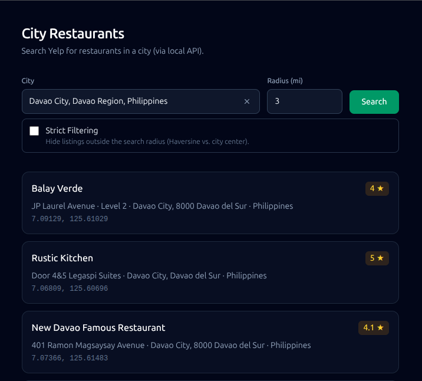

# Restaurants Lookup (Yelp)

Live Yelp data with Nominatim-resolved city centers, Haversine-backed relevance metadata, optional strict radius filtering, and a clear UI for listings Yelp returns outside the requested radius.



---

## System requirements

| | **Minimum** |
|---|-------------|
| **Node.js** | 20 or newer (LTS recommended) |
| **npm** | Comes with Node.js |
| **Git** | For cloning and updates |
| **Network** | Internet access for Yelp, maps/geocoding, and package installs |
| **Browser** | A current Chrome, Firefox, Edge, or Safari |

**Windows:** Windows 10 or 11. Automated setup uses [winget](https://learn.microsoft.com/en-us/windows/package-manager/winget/) (install **App Installer** from the Microsoft Store if `winget` is missing).

**Linux:** A normal desktop or server distro with `bash` and either `curl` or `wget`. Package installs may prompt for your **sudo** password.

**Optional:** [GNU Make](https://www.gnu.org/software/make/) — the repo includes a `Makefile` that mirrors common `npm` commands. If you do not have Make, use the `npm run` commands shown below.

**Windows + Linux-style tools:** [WSL 2](https://learn.microsoft.com/en-us/windows/wsl/install) works well; use the **Linux** instructions inside your WSL terminal.

---

## Setup guide

### 1. Installation

Pick **one** path: **automated** (easiest if you are new) or **manual** (full control).

#### Automated install (Git + Node + clone)

Use this when you **do not** have the project on your computer yet. The script installs **Git** and **Node.js 20+** when they are missing, then **clones** the repository.

**Windows (PowerShell)** — run these in the folder where you want the project (for example **Documents**). If Windows asks for permission, allow **winget** to install software.

```powershell
$base = "https://raw.githubusercontent.com/freepeace13/yelp-restaurants-lookup/refs/heads/main/scripts"
Invoke-WebRequest -Uri "$base/bootstrap-windows.ps1" -OutFile bootstrap-windows.ps1 -UseBasicParsing
powershell -ExecutionPolicy Bypass -File .\bootstrap-windows.ps1 -RepoUrl "https://github.com/freepeace13/yelp-restaurants-lookup.git"
```

**Linux and macOS (Terminal)**

```bash
curl -fsSL "https://raw.githubusercontent.com/freepeace13/yelp-restaurants-lookup/refs/heads/main/scripts/bootstrap-unix.sh" | bash -s -- "https://github.com/freepeace13/yelp-restaurants-lookup.git"
```

- **macOS** needs [Homebrew](https://brew.sh) for automatic installs.
- **Linux** may ask for your **sudo** password to install packages.

After the clone finishes, open a terminal **inside** the new project folder (by default the folder name matches the repo, e.g. `yelp-restaurants-lookup`) and continue with **First-time project setup** below.

#### Manual install

1. Install **Node.js 20+** from [https://nodejs.org](https://nodejs.org) (LTS) and **Git** from [https://git-scm.com](https://git-scm.com) on Windows, or use your package manager on Linux.
2. Clone the repository and go into the project folder:

```bash
git clone https://github.com/freepeace13/yelp-restaurants-lookup.git
cd yelp-restaurants-lookup
```

3. Continue with **First-time project setup** below.

---

### 2. Obtaining Yelp API keys

This app uses the **Yelp Fusion** HTTP API. You need a **free developer account** and an **API key** (not OAuth for basic usage).

1. Open **[Yelp for Developers](https://www.yelp.com/developers)** and sign in (or create a Yelp login).
2. Go to **Create App** (or **Manage App**) in the developer dashboard.
3. Create an application; fill in the required fields (name and contact are typical).
4. After the app is created, copy the **API Key** from the app details page. Treat it like a password — do not commit it to public repositories.

You will paste this key into `server/.env` in the next section as `YELP_API_KEY`.

---

### 3. First-time project setup

From the **project root** (the folder that contains `package.json`):

**Install dependencies and create the environment file**

This runs `npm install` for the workspace (client + server) and creates `server/.env` from `server/.env.example` if `.env` does not already exist (your existing `.env` is never overwritten).

```bash
npm run setup
```

**With GNU Make** (Linux, macOS, or WSL): `make setup` — run `make help` for a short list of shortcuts.

**Configure the API key**

1. Open `server/.env` in a text editor.
2. Set `YELP_API_KEY=` to your key, with **no spaces** around `=`, for example: `YELP_API_KEY=your_key_here`
3. Optionally change `PORT` if `3001` is already used on your machine. The web app (Vite) defaults to port **5173** unless your setup overrides it.

Save the file before starting the app.

---

### 4. Running locally

**Start the client and API together** (recommended for development):

```bash
npm run dev
```

Or with Make: `make dev`

Then open **[http://localhost:5173](http://localhost:5173)** in your browser. The API listens on **port 3001** by default (`PORT` in `server/.env`).

**Run only one part** (optional):

- Client only: `npm run dev:client`
- Server only: `npm run dev:server`

**Developers:** the repo is an **npm workspace** (React + Vite client, Express API). Root scripts in `package.json` orchestrate both packages. The `Makefile` mirrors common tasks for environments where Make is available.

---

### 5. Troubleshooting

| Problem | What to try |
|--------|-------------|
| `node` or `npm` not found | Install Node from [nodejs.org](https://nodejs.org), then **close and reopen** your terminal. From the project folder, run `npm run setup` again. |
| `winget` not found (Windows) | Install **App Installer** from the Microsoft Store, or install Git and Node manually and clone with Git or download a ZIP from GitHub. |
| `make` not found | Use `npm run setup` and `npm run dev` instead of `make`. |
| Port already in use | Change `PORT` in `server/.env`, or stop the other program using that port. If **5173** is busy, stop the other Vite/dev server or adjust the client dev port in Vite config. |
| Blank page or connection errors | Confirm both processes started (`npm run dev` runs client + server). Check the terminal for errors. |
| No restaurant results | Verify `YELP_API_KEY` in `server/.env` (no typos, file saved), restart with `npm run dev`. Check Yelp’s dashboard for app status or rate limits. |
| Permission or `sudo` prompts (Linux) | Expected when the bootstrap script installs system packages; use your login password. If you cannot use `sudo`, install Node and Git yourself and use **Manual install**. |

If a command fails, copy the **full error message** from the terminal; it usually names the missing program or port.
